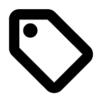

<svg class="logoHead" id="Layer_1" viewBox="0 0 203.39 211.95">
    <defs>
        
    </defs>
    <g id="layer1">
    <path
      id="path836"
      class="logoBase"
      d="M100.88,136.11v33.12h5.84v-13.71h8.36c1.26,0,2.45-.23,3.55-.68s2.04-1.09,2.82-1.9c.81-.84,1.44-1.8,1.9-2.87.49-1.1.73-2.27.73-3.5v-1.46c0-1.23-.24-2.4-.73-3.5-.45-1.1-1.09-2.06-1.9-2.87-.78-.81-1.72-1.44-2.82-1.9-1.1-.49-2.29-.73-3.55-.73h-14.2ZM154.13,136.11v8.36h-4.57v5.59h4.57v19.16h5.74v-19.16h4.57v-5.59h-4.57v-8.36h-5.74ZM170.67,136.11v8.36h-4.57v5.59h4.57v19.16h5.74v-19.16h4.57v-5.59h-4.57v-8.36h-5.74ZM106.72,141.9h7.39c1.39,0,2.42.37,3.06,1.12.65.71.97,1.65.97,2.82,0,1.23-.32,2.19-.97,2.87s-1.67,1.02-3.06,1.02h-7.39v-7.83ZM136.04,144.48c-1.39,0-2.66.23-3.79.68-1.13.42-2.11,1.02-2.92,1.8-.78.78-1.38,1.72-1.8,2.82-.39,1.1-.58,2.35-.58,3.74v6.66c0,1.36.19,2.61.58,3.74.42,1.1,1.02,2.06,1.8,2.87.81.78,1.78,1.38,2.92,1.8,1.13.42,2.4.63,3.79.63h1.99c1.43,0,2.69-.21,3.79-.63,1.13-.42,2.09-1.02,2.87-1.8.81-.81,1.43-1.77,1.85-2.87.42-1.13.63-2.38.63-3.74v-6.66c0-1.39-.21-2.64-.63-3.74s-1.04-2.04-1.85-2.82c-.78-.78-1.73-1.38-2.87-1.8-1.1-.45-2.37-.68-3.79-.68h-1.99ZM192.26,144.48c-1.39,0-2.66.23-3.79.68-1.13.42-2.11,1.02-2.92,1.8-.78.78-1.38,1.72-1.8,2.82-.39,1.1-.58,2.35-.58,3.74v6.66c0,1.36.19,2.61.58,3.74.42,1.1,1.02,2.06,1.8,2.87.81.78,1.78,1.38,2.92,1.8,1.13.42,2.4.63,3.79.63h1.99c1.43,0,2.69-.21,3.79-.63,1.13-.42,2.09-1.02,2.87-1.8.81-.81,1.43-1.77,1.85-2.87.42-1.13.63-2.38.63-3.74v-6.66c0-1.39-.21-2.64-.63-3.74s-1.04-2.04-1.85-2.82c-.78-.78-1.74-1.38-2.87-1.8-1.1-.45-2.37-.68-3.79-.68h-1.99ZM136.04,150.07h1.99c1.04,0,1.88.34,2.53,1.02.68.65,1.02,1.51,1.02,2.58v6.32c0,1.07-.34,1.95-1.02,2.63-.65.68-1.49,1.02-2.53,1.02h-1.99c-1.01,0-1.86-.34-2.58-1.02-.68-.68-1.02-1.56-1.02-2.63v-6.32c0-1.07.34-1.93,1.02-2.58.71-.68,1.57-1.02,2.58-1.02ZM192.26,150.07h1.99c1.04,0,1.88.34,2.53,1.02.68.65,1.02,1.51,1.02,2.58v6.32c0,1.07-.34,1.95-1.02,2.63-.65.68-1.49,1.02-2.53,1.02h-1.99c-1.01,0-1.86-.34-2.58-1.02-.68-.68-1.02-1.56-1.02-2.63v-6.32c0-1.07.34-1.93,1.02-2.58.71-.68,1.57-1.02,2.58-1.02ZM35.88,0C16,0,0,16,0,35.88v102.13c0,19.88,16,35.88,35.88,35.88h40.3c5.96,0,10.76-4.8,10.76-10.76v-30.64c0-5.96,4.8-10.76,10.76-10.76h40.3c19.88,0,35.88-16,35.88-35.88v-49.96c0-19.88-16-35.88-35.88-35.88H35.88ZM35.88,13.22h102.13c12.56,0,22.66,10.1,22.66,22.66v46.58c0,14.43-11.61,26.04-26.04,26.04h-36.92c-13.28,0-23.98,10.7-23.98,23.98v17.42c0,5.96-4.8,10.76-10.76,10.76h-27.09c-12.56,0-22.66-10.1-22.66-22.66V35.88c0-12.56,10.1-22.66,22.66-22.66Z"
    ></path>
  </g>
  <g>
    <rect
      class="logoBase"
      x="100.88"
      y="178.34"
      width="102.51"
      height="33.6"
      rx="10.76"
      ry="10.76"></rect>
    <path
      class="logoText"
      d="M112.13,191.06c-.57.89-.85,1.99-.85,3.3s.28,2.38.85,3.27c.57.89,1.36,1.57,2.36,2.03,1,.46,2.13.69,3.39.69,1,0,1.89-.14,2.65-.42s1.4-.69,1.91-1.22.88-1.17,1.12-1.9h2.83c-.17,1.27-.62,2.37-1.35,3.28-.73.91-1.7,1.61-2.92,2.09-1.21.48-2.63.73-4.24.73-1.39,0-2.67-.19-3.83-.56-1.16-.37-2.18-.92-3.03-1.64-.86-.72-1.52-1.61-1.99-2.68-.47-1.06-.7-2.28-.7-3.66s.23-2.62.7-3.67c.47-1.05,1.13-1.95,1.99-2.69.86-.74,1.87-1.29,3.03-1.67,1.16-.37,2.44-.56,3.83-.56,1.63,0,3.05.25,4.27.74,1.21.49,2.19,1.2,2.92,2.12.73.92,1.17,2.02,1.33,3.31h-2.8c-.24-.76-.61-1.42-1.12-1.95s-1.15-.95-1.92-1.24-1.66-.43-2.66-.43c-1.26,0-2.39.23-3.39.7-1,.47-1.79,1.15-2.36,2.04ZM142.43,192.69c.64.99.96,2.19.96,3.58s-.32,2.61-.96,3.59c-.64.99-1.51,1.73-2.61,2.24-1.1.51-2.36.76-3.77.76s-2.68-.25-3.8-.76-2-1.26-2.65-2.24-.97-2.18-.97-3.59.32-2.59.97-3.58c.65-.99,1.53-1.75,2.65-2.28s2.39-.79,3.8-.79,2.67.26,3.77.79c1.1.53,1.97,1.29,2.61,2.28ZM140.51,196.27c0-.92-.2-1.7-.6-2.34-.4-.65-.93-1.14-1.61-1.49-.67-.35-1.42-.52-2.26-.52s-1.59.17-2.27.51-1.23.83-1.64,1.48c-.42.65-.62,1.44-.62,2.37s.2,1.7.61,2.34c.41.65.96,1.13,1.64,1.45.69.32,1.45.48,2.28.48s1.56-.16,2.24-.48c.68-.32,1.22-.81,1.62-1.45s.6-1.43.6-2.34ZM167.84,190.86c-.45-.42-.98-.73-1.59-.93-.61-.2-1.29-.31-2.04-.31s-1.47.13-2.1.38c-.64.25-1.19.6-1.67,1.04-.48.44-.87.95-1.17,1.52-.11.21-.19.42-.27.64-.06-.28-.12-.56-.22-.8-.25-.61-.59-1.13-1.04-1.54-.45-.42-.99-.73-1.61-.93s-1.29-.31-2.03-.31c-.78,0-1.5.13-2.14.38-.65.25-1.21.61-1.68,1.06-.48.45-.86.96-1.15,1.53-.16.32-.28.65-.38.99v-3.68h-2.83v12.69h2.83v-7.53c.13-.4.32-.77.59-1.12.42-.55.97-1,1.64-1.35.67-.35,1.41-.52,2.23-.52,1.07,0,1.86.25,2.36.75s.75,1.27.75,2.31v7.47h2.83v-8.03s0-.07,0-.1c.09-.18.2-.35.33-.52.42-.55.96-1,1.63-1.35.67-.35,1.42-.52,2.23-.52,1.07,0,1.86.25,2.36.75.5.5.75,1.27.75,2.31v7.47h2.85v-8.03c0-.83-.13-1.55-.38-2.17-.25-.61-.61-1.13-1.06-1.54ZM195.37,192.4c-.25-.61-.61-1.13-1.06-1.54-.45-.42-.98-.73-1.59-.93-.61-.2-1.29-.31-2.04-.31s-1.47.13-2.1.38c-.64.25-1.19.6-1.67,1.04-.48.44-.87.95-1.17,1.52-.11.21-.19.42-.27.64-.06-.28-.12-.56-.22-.8-.25-.61-.59-1.13-1.04-1.54-.45-.42-.99-.73-1.61-.93s-1.29-.31-2.03-.31c-.78,0-1.5.13-2.14.38-.65.25-1.21.61-1.68,1.06-.48.45-.86.96-1.15,1.53-.16.32-.28.65-.38.99v-3.68h-2.83v12.69h2.83v-7.53c.13-.4.32-.77.59-1.12.42-.55.97-1,1.64-1.35.67-.35,1.41-.52,2.23-.52,1.07,0,1.86.25,2.36.75s.75,1.27.75,2.31v7.47h2.83v-8.03s0-.07,0-.1c.09-.18.2-.35.33-.52.42-.55.96-1,1.63-1.35.67-.35,1.42-.52,2.23-.52,1.07,0,1.86.25,2.36.75.5.5.75,1.27.75,2.31v7.47h2.85v-8.03c0-.83-.13-1.55-.38-2.17Z"
    ></path>
  </g>
</svg>

# Welcome!
Don't worry this is not written by, or, for - a bloody corporate conglomerate let alone those funny virtual robots that would happily hallucinate for you.

I figured it is still important for me to lay down the general rules and FAQ, so I'll try my best to keep it as clear as possible, though I will touch on potential tangets inside...
> these things.

Feel free to [ask me directly](https://x.com/Potto2292) if you need to ask further!  
###### Due to the nature of twitter dm's, it might take some time until I can check new messages in my inbox...
---

# Common procedures
## 1. Confirmation 
Once you sent your order, I should be contacting you with your provided contact shortly!
> If I somehow never contact you back, it might either be:
> - the contact you provided is unreachable to me
> - [I refused to work with you](#8-simply-common-sense)

## 2. Assets review 
The moment you sent your inquiry, I should be able to see your references and your request. From there I'll "**evaulate**" whether I can work with it, I'll of course let you know either way
> this touches on how complex your character design is, your overall request, and the effort required

## 3. Sketch 
If all went well, I'll attempt to draw a very rough idea of how your order will look like

## 4. Payment 
**Once** you are happy with the rough visuals, I will send you a payment invoice before I can go further

## 5. Packaging 
The moment I'm done, I will let you know and package the finished pieces and its files into a neat zip file (usually `.7z`)

## 6. That's it! 
That's a wrap, thank you for considering me!

# TOS
## There they are, the deets.
Here are the general rules!

### 1. Patience
Putting yourself in the inquiry means you agree to keep your patience until I'm finished with your request. I am a relatively slow artist (probably atrociously slow even). This would further be amplified if your order is relatively complex and or featured with all sorts of backgrounds
> **Though it is important to mention:**  
> - If I haven't given you ANY updates in a span of **more than 2 weeks** (I might be cooked), do actually remind me!  
> - And if things aren't going as planned or otherwise necessary, we can discuss whether I should do a refund or consider other options.

### 2. What I will and will Not draw
The general gist is:

#### Yes:
- SFW & NSFW
- Backgrounds
- Accessories
- Ponies or Anthros

#### No:
- Designs that is simply too complex
- "Hardcore genres" (extreme fetishes, etc.)
> Won't hurt to ask if you're not sure.
- Gore and graphic content (simple wounds is plausible)
- Request that would likely demonize someone or some group
- Polarizing, controversial, or high risk topics
- Characters you don't have permission for you to use within your request
> If you're commissioning for someone else, please **make sure** you have the **owner's consent** to be featured in your request. **Regardless** if it's SFW or NSFW.

### 3. Payment policy
- Payment processor will be discussed in chat!
- On the payment process, you'll have up to **7 days** to complete the transaction - Otherwise your request will get discarded.
- By sheer chance, if you're a local **Indonesian**, do let me know as we could use alternative processors.
> Exchange rate, naturally, still applies

### 4. Mid-edits and changes
- While in the **rough sketch** process, you have the most freedom to ask for changes as many times as needed

- But if it's already in the process of **drawing** or **rendering**, it very much **depends** and naturally be more **limited** in what I can still change. This means I couldn't simply redo the drawing itself **(pose change, complete background change, etc.)**

- Edits **may** add additional charges, whether it is **adding accessories**, **characters**, or **complex** edits
> **Tip:** Try to make sure you're happy and **final** with your request if you can, as adding things in the middle that requires additional charges is likely going to have a small sum. In which **may get hit with significant transfer fee**. It's never recommended to send small amounts in almost any payment services.

### 5. Refunds
Depending on how far I am in progress with your request, the refund will most likely be partial.
> There are many variables to consider, even just accepting an inquiry, interacting, and discussing with people still spends energy... *(Call it service fee, perhaps.)*

### 6. Artwork Visibility
I usually post commission results on my social medias. **If you wish** to make your request be **private**, or **anonymized**, feel free to let me know.

### 7. Commercial
Commercial usage of my work is **strongly prohibited** without prior agreements.
- You are not allowed to **resell** my artworks
- I **retain** all the rights to all the commission results
> Unless I **explicitly stated** otherwise.

### 8. Simply: common-sense
Common-ities.

I reserve the right to **decline** or **stop working** on your inquiry, whether it is due to the ambiguity or from the subject matter:
- Haggling over set prices
- Intentionally postponing payment without concrete reason - Let's respect each other
- Continuously **demand speedy completion** after payment and without any agreement

###### *[Refund policy applies](#5-refunds)

Take it easy, I'm not that grumpy - so no need to make your messages looking like the emails I see at 3 am. This TOS is long and elaborate simply in an attempt to mention everything that needs to be said.

> Do not **use** OR **alter** any of my work with *any [ai generative tool] technology* as **I do not consent** for my work to be put through it.

# FAQ
## Frequently, sure
Frequently asked questions!  
...

### Q :: Can you draw `${else}` ?
Outside of what [I will not draw](#2-what-i-will-and-will-not-draw) - if you're still unsure, feel free to ask!

###  Q :: What counts as "Acessories"?
Any items that a character is:
- wearing
- using
- interacting with

The last two probably means the same, but that's the gist of it.

### Q :: Failed to parse source for import analysis because the content contains invalid JS syntax. If you are using JSX, make sure to name the file with the .jsx or .tsx extension.?
what

---